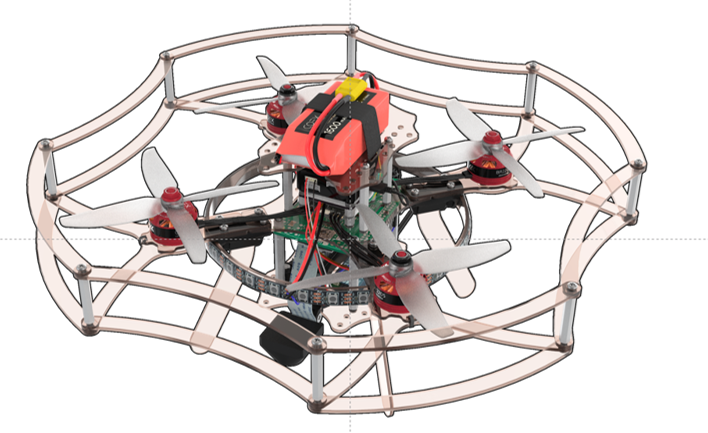

Инструкция по сборке конструктора Клевер 3
==========================================
В данной инструкции рассматривается сборка паячного комплекта COEX Clever 3 

Состав конструктора
-------------------

Установка моторов
-------------------
1. Распаковать моторы
2. Используя ножницы, подготовить провода:

    a. Обрезать половину длины (оставив 30 мм.
    
    b. Надрезать изоляционный слой по окружности.
    
    c. Зачистить (снять 2мм термоизоляции с конца провода, не повредив медные жилы).
    
    d. Скрутить провода.
    
    e. Залудить*, используя пинцет.

Залудить - это:
* Нанести флюс на оголенную часть провода.
* Покрыть припоем.

3. Закрепить мотор на луче винтами М3х8
4. Вставить  гайки М3 (4 шт) в пластиковый держатель.
*Для удобства можно использовать длинный винт, либо плоскогубцы

5. Закрепить мотор на держатель

