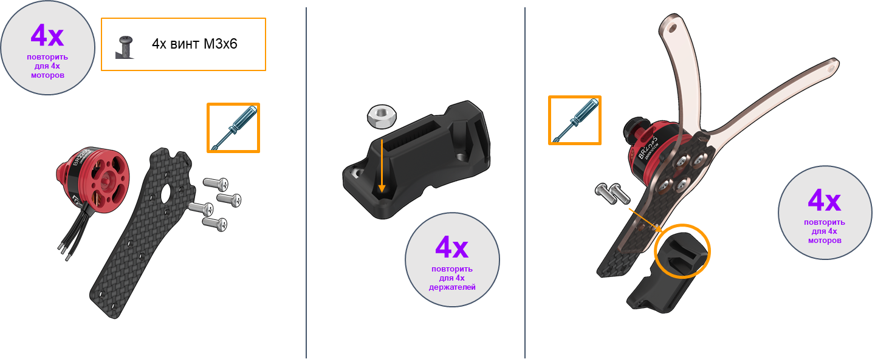
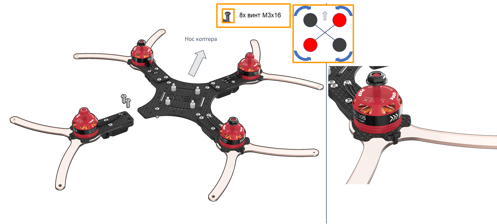

Инструкция по сборке конструктора Клевер 3
==========================================
В данной инструкции рассматривается сборка паячного комплекта COEX Clever 3 с платой регуляторов 4в1

Состав конструктора
-------------------

Техника безопасности при пайке
-------------------
Перед использованием паяльного оборудования обязательно ознакомьтесь с техникой безопасности
[Техника безопасности при пайке](tb.md)

Установка моторов
-------------------
1. Распаковать моторы
2. Используя ножницы, подготовить провода:

    a. Обрезать половину длины (оставив 30 мм.
    
    b. Надрезать изоляционный слой по окружности.
    
    c. Зачистить (снять 2мм термоизоляции с конца провода, не повредив медные жилы).
    
    d. Скрутить провода.
    
    e., используя пинцет.

Залудить - это:
* Нанести флюс на оголенную часть провода.
* Покрыть припоем.

3. Закрепить мотор на луче винтами М3х8
4. Вставить  гайки М3 (4 шт) в пластиковый держатель.
*Для удобства можно использовать длинный винт, либо плоскогубцы

5. Закрепить мотор на держатель

Монтаж крепежных элементов
-------------------
1. Установить стойки 6 мм (4 шт) для крепления PDB на раму винтами М3х8
2. Установить стойки 6 мм (4 шт) для крепления RASPBERRY PI на раму винтами М3х8

3. Установить на раму собранную конструкцию, соблюдая схему, винтами М3х16
4. Стянуть хомутом (стяжкой) луч и защиту луча
*Хвост от хомута (стяжки) отрезать ножницами

Монтаж светодиодной ленты
-------------------
1.  Установить каркас для светодиодной ленты, используя прорези в держателях для ножек
2. Убедиться, что провода припаяны верно:
* +5V:  красный без разъема
* GND: черный без разъема
* DI: любой цвет с разъемом типа МАМА

3.  Прикрепить светодиодную ленту на каркас, используя липкий слой ленты или 2х сторонний скотч
ПРОВОДА ОТ СВЕТОДИОДНОЙ ЛЕНТЫ К НОСОВОЙ ЧАСТИ КОПТЕРА 

Монтаж разъемов питания
-------------------
МОНТАЖ СИЛОВОГО РАЗЪЕМА
1. Залудить контактные площадки силового разъема
2. Зачистить силовые провода с обеих сторон, используя ножницы
3. Залудить концы проводов
4. Найти "+" и "-" на разъеме
5. Припаять черный провод к "-", а красный к "+" разъема
6. Заизолировать места пайки

МОНТАЖ РАЗЪЕМА 5В
1. Обрезать/вытащить все пины из одного из разъемов. Отсоединить его.
2. Поддеть канцелярским ножом фиксатор на оставшемся разъеме, чтобы освободить 3-й провод.
Убрать 3-й (оранжевый) провод из разъема, за ненадобностью.
3. Длина оставшихся черного и красного проводов  12 см. Залудить концы.

### Монтаж платы распределения питания

#### Предпаячная проверка

[Статья про прозвонку](testConnection.md)

Прозвонить следующие цепи на НЕЗАМКНУТОСТЬ (отсутствие звукового сигнала мультиметра):
* “BAT+” и “BAT-”
* “12V” и “GND”
* “5V” и “GND”

Прозвонить следующие цепи на ЗАМКНУТОСТЬ (появление звукового сигнала мультиметра):
* “BAT-” c каждым контактом, обозначенным “-” и “GND”
* “BAT+”, с каждым контактом, обозначенным “+”

#### Залудить контактные площадки платы питания
1. [Залудить*](zap.md) контактные площадки платы питания.
2. С помощью мультиметра проверить отсутствие контактного замыкания на плате (прозвонить)

Чтобы припой аккуратно заполнил всю площадку, необходимо её прогреть. Для этого нужно удерживать жало паяльника на контактной плащадке в течение 2 сек (или больше, если потребуется)

#### Монтаж разъемов питания
1. Припаять разъем для АКБ, соблюдая полярность на контактных площадках.
2. Припаять разъем 5В, соблюдая полярность на контактных площадках.
    (на изображении: красный провод - это питание “+”) 
3. Установить шлейф питания для полетного контроллера Pixracer 

#### Проверка выходного напряжения
1. Подключить АКБ
2. Выставить режим мультиметра "Измерение напряжения"
3. Проверить выходное напряжение на припаянных разъемах и контактных площадках платы

#### Монтаж платы регуляторов
УСТАНОВКА ПЛАТЫ РЕГУЛЯТОРОВ 4in1
1. Правильно соориентировать плату
2. Установить на стойки плату регуляторов
3. Закрепить стойками М3х6

ПАЙКА ФАЗНЫХ ПРОВОДОВ МОТОРОВ К РЕГУЛЯТОРАМ
Необходимо спаять два провода между собой

1. Обрезать фазные провода платы регуляторов
2. На один из проводов надеть термоусадку длиной 1.5-2 см
3. Зачистить концы на проводах (как показано на изображении)
4. Переплести жилы проводов.
5. Скрутить два провода между собой
6. Нанести флюс и припой.
7. Переместить термоусадку на место пайки и усадить феном
Повторить для остальных проводов.

#### Монтаж платы питания PDB
1. Припаять провода питания от светодиодной ленты к площадкам 5В и GND
2. Оставить длину проводов питания платы регуляторов 5 см
3. Припаять провода питания от платы регуляторов к площадкам + и -

