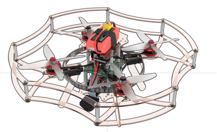
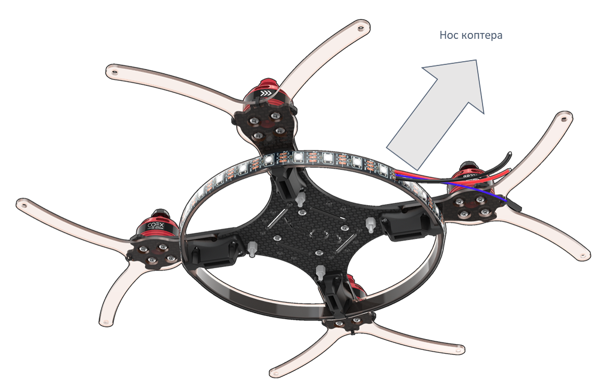

Инструкция по сборке конструктора Клевер 3
==========================================
В данной инструкции рассматривается сборка паячного комплекта COEX Clever 3 

Состав конструктора
-------------------

Установка моторов
-------------------
1. Распаковать моторы
2. Используя ножницы, подготовить провода:

    a. Обрезать половину длины (оставив 30 мм.
    
    b. Надрезать изоляционный слой по окружности.
    
    c. Зачистить (снять 2мм термоизоляции с конца провода, не повредив медные жилы).
    
    d. Скрутить провода.
    
    e. Залудить*, используя пинцет.

Залудить - это:
* Нанести флюс на оголенную часть провода.
* Покрыть припоем.

3. Закрепить мотор на луче винтами М3х8
4. Вставить  гайки М3 (4 шт) в пластиковый держатель.
*Для удобства можно использовать длинный винт, либо плоскогубцы

5. Закрепить мотор на держатель

Монтаж крепежных элементов
-------------------
1. Установить стойки 6 мм (4 шт) для крепления PDB на раму винтами М3х8
2. Установить стойки 6 мм (4 шт) для крепления RASPBERRY PI на раму винтами М3х8

3. Установить на раму собранную конструкцию, соблюдая схему, винтами М3х16
4. Стянуть хомутом (стяжкой) луч и защиту луча
*Хвост от хомута (стяжки) отрезать ножницами

Монтаж светодиодной ленты
-------------------
1.  Установить каркас для светодиодной ленты, используя прорези в держателях для ножек
2. Убедиться, что провода припаяны верно:
* +5V:  красный без разъема
* GND: черный без разъема
* DI: любой цвет с разъемом типа МАМА

3.  Прикрепить светодиодную ленту на каркас, используя липкий слой ленты или 2х сторонний скотч
ПРОВОДА ОТ СВЕТОДИОДНОЙ ЛЕНТЫ К НОСОВОЙ ЧАСТИ КОПТЕРА 

